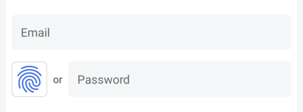
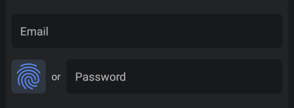
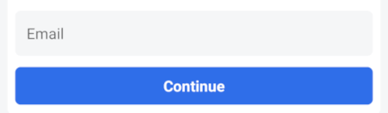
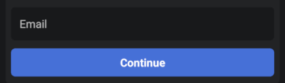

# OwnID React Native Gigya SDK

The OwnID React Native SDK is a client library offering a secure and passwordless login alternative for your React Native applications. It leverages [Passkeys](https://www.passkeys.com) to replace conventional passwords, fostering enhanced authentication methods.

The OwnID React Native Gigya SDK expands [OwnID React Native Core SDK](../README.md) functionality by offering a prebuilt Gigya Integration, supporting Email/Password-based [Gigya Android Authentication](https://github.com/SAP/gigya-android-sdk) and [Gigya iOS Authentication](https://github.com/SAP/gigya-swift-sdk).

For more general information about OwnID React Native SDKs, see [OwnID React Native SDK](../README.md).

## Table of contents

* [Before You Begin](#before-you-begin)
* [Add Dependency to your project](#add-dependency-to-your-project)
* [Enable passkey authentication](#enable-passkey-authentication)
* [Create OwnID Gigya instance](#create-ownid-gigya-instance)
* [Add OwnID UI to application](#add-ownid-ui-to-application)
   + [Gigya with Web Screen-Sets](#gigya-with-web-screen-sets)
   + [Gigya with react native UI](#gigya-with-react-native-ui)
     * [Implement the Registration Screen](#implement-the-registration-screen)
     * [Implement the Login Screen](#implement-the-login-screen)
     * [Error and Exception Handling](#error-and-exception-handling)   
* [Additional Configuration](#additional-configuration)   

## Before You Begin

Before incorporating OwnID into your application, you need to create an OwnID application in [OwnID Console](https://console.ownid.com) and integrate it with your project. 

## Add Dependency to your project

The OwnID React Native Core & Gigya SDKs are available from the [npm repository](https://www.npmjs.com/search?q=%40ownid%2Freact-native-):
```bash
npm install @ownid/react-native-core @ownid/react-native-gigya
cd ios && pod install && cd .. # CocoaPods on iOS needs this extra step
```
The OwnID React Native Core & Gigya SDKs supports [autolinking](https://github.com/react-native-community/cli/blob/main/docs/autolinking.md), build based on Android API 34 (minimum API 23), iOS 14 and higher.

## Enable passkey authentication

The OwnID SDK uses [Passkeys](https://www.passkeys.com) to authenticate users. 

> [!IMPORTANT]
>
> To enable passkey support for your Android app, associate your app with a website that your app owns using [Digital Asset Links](https://developers.google.com/digital-asset-links) by following this guide: [Add support for Digital Asset Links](https://developer.android.com/training/sign-in/passkeys#add-support-dal).
>
> To enable passkey support for your iOS app,  associate your app with a website that your app owns using Associated Domains by following this guide: [Supporting associated domains](https://developer.apple.com/documentation/xcode/supporting-associated-domains).

## Create OwnID Gigya instance

Before incorporating OwnID UI on your screens in React Native, you need to create the OwnID Gigya instance.

If you are using the default Gigya account model (`GigyaAccount` class / `GigyaAccount` struct), then you can do this from React Native. To do so, call `OwnIdGigya.init` function with OwnID configuration. At a minimum, this configuration object defines the OwnID App Id - the unique identifier of your OwnID application, which you can obtain from the [OwnID Console](https://console.ownid.com):

```ts
import OwnIdGigya from '@ownid/react-native-gigya';

await OwnIdGigya.init({ appId: "gephu342dnff2v" }); // Replace with your App Id
```

> [!IMPORTANT]
>
> `OwnIdGigya.init` must be called after initializing the Android/iOS native Gigya instance. Refer to the details for [Android](https://github.com/SAP/gigya-android-sdk/tree/main/sdk-core#initialization) and [iOS](https://github.com/SAP/gigya-swift-sdk/tree/main/GigyaSwift#initialization). 
>
> It is recommended to create the OwnID instance as early as possible in the application lifecycle. Failure to do so may result in errors when displaying OwnID UI.

> [!NOTE]
>
> If you are using a custom Gigya account model, you need to create the OwnID Gigya instance in native code. Refer to the [OwnID Android Gigya SDK](https://github.com/OwnID/ownid-android-sdk) and [OwnID iOS Gigya SDK](https://github.com/OwnID/ownid-ios-sdk).

For additional configuration options refer to [Advanced Configuration](sdk-advanced-configuration.md).

## Add OwnID UI to application

The process of integrating OwnID into your Registration or Login screens varies depending on the type of UI utilized in your application.

If your application utilizes Gigya with Web Screen-Sets, then OwnID integration can be achieved through [OwnID WebSDK](https://docs.ownid.com/) and OwnID SDK WebView Bridge.

If your application employs react native UI with Gigya, please follow the instructions provided under [Gigya with react native UI](#gigya-with-native-views).

### Gigya with Web Screen-Sets

The OwnID WebView Bridge, an integral part of the OwnID Core SDK, empowers the [OwnID WebSDK](https://docs.ownid.com/) to leverage the native capabilities of the OwnID SDK. The bridge facilitates the injection of JavaScript code, enabling communication between the [OwnID WebSDK](https://docs.ownid.com/) and the native OwnID SDK.

If you're running Gigya with Web Screen-Sets and want to utilize OwnID WebView Bridge, then here's how you can integrate with OwnID WebView Bridge on each platform:

**Android**

Add `OwnId.configureGigyaWebBridge()` **before** initializing Gigya SDK:

See [complete example](../demo-gigya-screens/android/app/src/main/java/com/ownid/demo/gigya/screens/MainApplication.kt)

```kotlin
class MyApplication : Application() {
   override fun onCreate() {
      super.onCreate()
      SoLoader.init(this, false)

      // Configure Gigya SDK to use OwnId Gigya WebBridge
      OwnId.configureGigyaWebBridge()
      
      GigyaSdkModule.setSchema(this, GigyaAccount::class.java)
   }
}
```

**iOS**

Add `[gigya configureWebBridge]` after the Gigya extension initialization.

See [complete example](../demo-gigya-screens/ios/OwnIDReactNativeGigyaDemo/App/AppDelegate.mm)

```objc
GigyaExtension * gigya = [[GigyaExtension alloc] init];
[gigya setMySchema];

[gigya configureWebBridge];

```

Add `OwnID.GigyaSDK.configureWebBridge(accountType: HostModel.self)` to `GigyaExtension`:

See [complete example](../demo-gigya-screens/ios/OwnIDReactNativeGigyaDemo/App/GigyaExtenstion.swift)

```swift
@objc public class GigyaExtension: NSObject {
  @objc public func configureWebBridge() {
    // Configure Gigya SDK to use OwnId Gigya WebBridge
    OwnID.GigyaSDK.configureWebBridge(accountType: HostModel.self)
  }
  
  @objc public func setMySchema() {
    GigyaSdk.setSchema(HostModel.self)
  }
}
```

Next, add [OwnID WebSDK](https://docs.ownid.com/) to Gigya Web Screen-Sets.

### Gigya with react native UI

#### Implement the Registration Screen

Using the OwnID SDK to implement passwordless authentication starts by adding an `OwnIdButton` view with type `OwnIdButtonType.Register` to your Registration screen. Your app then waits for callbacks while the user interacts with OwnID.

See [complete example](../demo-gigya/src/screens/registration.tsx)

```ts
import { OwnIdButton, OwnIdButtonType, OwnIdRegister, OwnIdResponse, OwnIdError } from '@ownid/react-native-gigya';

const [name, setName] = useState('');
const [email, setEmail] = useState('');

const [ownIdReadyToRegister, setOwnIdReadyToRegister] = useState(false);

const onSubmit = async (event) => {
  event.preventDefault();
  ...
  
  if (ownIdReadyToRegister) {
    // You can define custom parameters for the registration request, like profile.firstName
    const profile = JSON.stringify({ firstName: name });
    OwnIdRegister(email, { profile });
    return;
  }
  
  ...
}

const onLogin = (response: OwnIdResponse) => {
  // Called when the user is successfully logged in using OwnID
  setOwnIdReadyToRegister(false);
};

const onRegister = (response: OwnIdResponse) => {
  // Called when the user successfully finishes the OwnID Register flow and the SDK is in the ready-to-register state
  setOwnIdReadyToRegister(true);
  setEmail(response.loginId!);
};

const onUndo = () => {
  // Called when the user selects the "Undo" option in the ready-to-register state
  setOwnIdReadyToRegister(false);
};

const onError = (error: OwnIdError) => {
  // Called when an error occurs in the OwnID flow
};

return (
  <View>
    <TextInput value={name} onChangeText={setName} placeholder="First Name"/>
    <TextInput value={email} onChangeText={setEmail} placeholder="Email"/>

    <View>
      <OwnIdButton
        type={OwnIdButtonType.Register}
        loginId={email} 
        onRegister={onRegister} 
        onLogin={onLogin}
        onUndo={onUndo} 
        onError={onError}
      />
      <TextInput placeholder="Password"/>
    </View>

    <TouchableOpacity onPress={onSubmit}><Text>Create Account</Text></TouchableOpacity>
  </View>
);
```

There are mandatory callbacks: 
 * `onLogin` - Called when user is successfully logged in using OwnID.
 * `onRegister` - Called when user is successfully finished OwnID Register flow and SDK in ready-to-register state.

and optional callbacks: 
 * `onBusy` - Called to notify OwnID busy status.
 * `onUndo` - Called when user selected "Undo" option in ready-to-register state.
 * `onError` - Called when error happened in OwnID flow.

> [!IMPORTANT]
>
> When `onRegister` is called, indicating the completion of the OwnID Registration flow, the user is returned to the Registration screen (ready-to-register state).
> 
> It's crucial to note that the user account is not yet created within Gigya at this stage.
>
> On the Registration screen, the user can fill in optional or mandatory data and click the "Submit" button or its equivalent.
>
> On the "Submit" button click, call `OwnIdRegister` function.

The OwnID `OwnIdRegister` function calls the standard Gigya SDK function `register(String email, String password, Map<String, Object> params, GigyaLoginCallback<T> callback)` to register the user in Gigya, so you do not need to call this Gigya function yourself. You can define custom parameters for the registration request and pass it to `OwnIdRegister`. These parameters are passed to the Gigya registration call [Android](https://github.com/SAP/gigya-android-sdk/tree/main/sdk-core#register-via-email--password) and [iOS](https://github.com/SAP/gigya-swift-sdk/tree/main/GigyaSwift#login--registration).

> [!NOTE]
>
> When a user registers with OwnID, a random password is generated and set for the user's Gigya account.

For more configuration options, refer to the [OwnID React Native SDK - Advanced Configuration](sdk-advanced-configuration.md)

#### Implement the Login Screen

The process of implementing your Login screen is very similar to the one used to implement the Registration screen - add an OwnId UI to your Login screen.

Add the passwordless authentication to your application's Login screen by including one of OwnID button variants:

1. Side-by-side button: The `OwnIdButton` that is located on the side of the password input field.
2. Password replacing button: The `OwnIdAuthButton` that replaces password input field.

You can use any of this buttons based on your requirements. Your app then waits for callbacks while the user interacts with OwnID.

See [complete example](../demo-gigya/src/screens/login.tsx)

1. **Side-by-side button**.

    Add `OwnIdButton` view with type `OwnIdButtonType.Login`:

    ```ts
    import { OwnIdButton, OwnIdButtonType, OwnIdResponse, OwnIdError } from '@ownid/react-native-gigya';

    const [email, setEmail] = useState('');

    const onLogin = (response: OwnIdResponse) => {
      // Called when the user is successfully logged in using OwnID
    };

    const onError = (error: OwnIdError) => {
      // Called when an error occurs in the OwnID flow 
    };

    return (
      <View>
        <TextInput value={email} placeholder="Email"/>

       <View>
          <OwnIdButton
            type={OwnIdButtonType.Login}
            loginId={email}
            onLogin={onLogin} 
            onError={onError}
          />
          <TextInput placeholder="Password"/>
       </View>
     </View>
    );
    ```
     

2. **Password replacing button**.

    Add `OwnIdAuthButton`:

    ```ts
    import { OwnIdAuthButton, OwnIdResponse, OwnIdError } from '@ownid/react-native-gigya';
    
    const [email, setEmail] = useState('');

    const onLogin = (response: OwnIdResponse) => {
      // Called when the user is successfully logged in using OwnID
    };

    const onError = (error: OwnIdError) => {
      // Called when an error occurs in the OwnID flow 
    };

    return (
      <View>
        <TextInput value={email} placeholder="Email"/>

       <View>
          <OwnIdAuthButton
            loginId={email}
            onLogin={onLogin} 
            onError={onError}
          />
       </View>
     </View>
    );
    ```
    

There is mandatory callback: 
 * `onLogin` - Called when user is successfully logged in using OwnID.

and optional callbacks: 
 * `onBusy` - Called to notify OwnID busy status.
 * `onError` - Called when error happened in OwnID flow.

For more configuration options, refer to the [OwnID React Native SDK - Advanced Configuration](sdk-advanced-configuration.md)

#### Error and Exception Handling

The `OwnIdError` object described in [Error and Exception Handling](sdk-advanced-configuration.md#error-and-exception-handling) may contain `gigyaError` property with Gigya error data if error is Gigya Error.

Example: 
```json
"gigyaError": {
    "callId": "349934eb13b543628dff7bf145431c01",
    "data": "{\"callId\":\"349934eb13b543628dff7bf145431c01\",\"errorCode\":206002,....}",
    "errorCode": 206002,
    "localizedMessage": "Account Pending Verification"
}
```

## Additional Configuration

For more configuration options including UI customization, refer to the [OwnID React Native SDK - Advanced Configuration](sdk-advanced-configuration.md)

The OwnID React Native Gigya SDK is built on the native [OwnID Android Gigya SDK](https://github.com/OwnID/ownid-android-sdk) and [OwnID iOS Gigya SDK](https://github.com/OwnID/ownid-ios-sdk) modules. For additional configuration options, consult their respective documentation.
