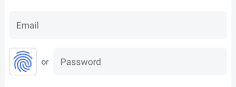
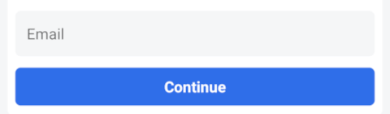

# OwnID React Native Core SDK - Direct Integration

The OwnID React Native SDK is a client library offering a secure and passwordless login alternative for your React Native applications. It leverages [Passkeys](https://www.passkeys.com) to replace conventional passwords, fostering enhanced authentication methods.

The OwnID React Native Core SDK wraps native [Android Core](https://github.com/OwnID/ownid-android-sdk) and [iOS Core](https://github.com/OwnID/ownid-ios-sdk) modules, allowing seamless integration by directly handling OwnID Response within React Native applications.

For more general information about OwnID React Native SDKs, see [OwnID React Native SDK](../README.md).

## Table of contents

* [Before You Begin](#before-you-begin)
* [Add Dependency to your project](#add-dependency-to-your-project)
* [Enable passkey authentication](#enable-passkey-authentication)
* [Integrate OwnID with your React Native App](#integrate-ownid-with-your-react-native-app)
   + [Create OwnID instance](#create-ownid-instance)
   + [Implement the Registration Screen](#implement-the-registration-screen)
   + [Implement the Login Screen](#implement-the-login-screen)
* [Credential enrollment](#credential-enrollment)   
* [Additional Configuration](#additional-configuration)   

## Before You Begin

Before incorporating OwnID into your application, you need to create an OwnID application in [OwnID Console](https://console.ownid.com) and integrate it with your identity platform. 

## Add Dependency to your project

The OwnID React Native Core SDK is available from the [npm repository](https://www.npmjs.com/package/@ownid/react-native-core):
```bash
npm install @ownid/react-native-core
cd ios && pod install && cd .. # CocoaPods on iOS needs this extra step
```

The OwnID React Native Core SDK supports [autolinking](https://github.com/react-native-community/cli/blob/main/docs/autolinking.md), build based on Android API 34 (minimum API 23), iOS 14 and higher.

## Enable passkey authentication

The OwnID SDK uses [Passkeys](https://www.passkeys.com) to authenticate users. 

> [!IMPORTANT]
>
> To enable passkey support for your Android app, associate your app with a website that your app owns using [Digital Asset Links](https://developers.google.com/digital-asset-links) by following this guide: [Add support for Digital Asset Links](https://developer.android.com/training/sign-in/passkeys#add-support-dal).
>
> To enable passkey support for your iOS app,  associate your app with a website that your app owns using Associated Domains by following this guide: [Supporting associated domains](https://developer.apple.com/documentation/xcode/supporting-associated-domains).

## Integrate OwnID with your React Native App

Before adding OwnID UI to your React Native app screens, you need to create instance of OwnID.

### Create OwnID instance

To create instance of OwnID call `OwnId.init` and pass configurations parameters. At a minimum, configuration must define the OwnID App Id - the unique identifier of your OwnID application, which you can obtain from the [OwnID Console](https://console.ownid.com). 

See [complete example](../demo-integration/index.js)

```js
import OwnId from '@ownid/react-native-core';

await OwnId.init({ appId: "gephu342dnff2v" }, "OwnIDIntegration/3.3.2"); // Replace with your App Id
```

> [!NOTE]
>
> It is recommended to create the OwnID instance as early as possible in the application lifecycle. Failure to do so may result in errors when displaying OwnID UI.

### Implement the Registration Screen

Using the OwnID SDK to implement passwordless authentication starts by adding an `OwnIdButton` view with type `OwnIdButtonType.Register` to your Registration screen. Your app then waits for callbacks while the user interacts with OwnID.

See [complete example](../demo-integration/src/screens/registration.tsx)

```ts
import OwnId, { OwnIdButton, OwnIdButtonType, OwnIdButtonPosition, OwnIdResponse, OwnIdError } from '@ownid/react-native-core';

const [name, setName] = useState('');
const [email, setEmail] = useState('');
const [ownIdData, setOwnIdData] = useState<any>(null);

const loginWithToken = async (token: string) => {
  // Login to your identity platform 
};

const onSubmit = async (event) => {
  event.preventDefault();
  ...

  if (ownIdData) {
    // Implement registration within your identity platform with ownIdData
    // Use OwnId.generatePassword(16) to generate random password
  } else {
    // Standard registration logic without OwnID
  }
  
  ...
};

const onLogin = async (response: OwnIdResponse) => {
  // Called when the user successfully finishes the OwnID Login flow
  setEmail(response.loginId!);
  const token = ... // Extract information from response.payload!.data
  await loginWithToken(token);
};

const onRegister = (response: OwnIdResponse) => {
  // Called when the user successfully finishes the OwnID Register flow
  setEmail(response.loginId!);
  setOwnIdData(response.payload!.data);
};
 
const onUndo = () => {
  // Called when the user selects the "Undo" option
  setOwnIdData(null);
};  

const onError = (error: OwnIdError) => {
  // Called when an error occurs in the OwnID flow
};

return (
  <View>
    <TextInput value={name} onChangeText={setName} placeholder="First Name"/>
    <TextInput value={email} onChangeText={setEmail} placeholder="Email"/>

    <View>
      <OwnIdButton
        type={OwnIdButtonType.Register}
        loginId={email} 
        onRegister={onRegister} 
        onLogin={onLogin}
        onUndo={onUndo} 
        onError={onError}
      />
      <TextInput placeholder="Password"/>
    </View>

    <TouchableOpacity onPress={onSubmit}><Text>Create Account</Text></TouchableOpacity>
  </View>
);
```

There are mandatory callbacks: 
 * `onLogin` - Called when user is successfully finished OwnID Login flow.
 * `onRegister` - Called when user is successfully finished OwnID Register flow.

and optional callbacks: 
 * `onBusy` - Called to notify OwnID busy status.
 * `onUndo` - Called when user selected "Undo" option.
 * `onError` - Called when error happened in OwnID flow.

For more configuration options, refer to the [OwnID React Native SDK - Advanced Configuration](sdk-advanced-configuration.md)

### Implement the Login Screen

The process of implementing your Login screen is very similar to the one used to implement the Registration screen - add an OwnId UI to your Login screen.

Add the passwordless authentication to your application's Login screen by including one of OwnID button variants:

1. Side-by-side button: The `OwnIdButton` that is located on the side of the password input field.
2. Password replacing button: The `OwnIdAuthButton` that replaces password input field.

You can use any of this buttons based on your requirements. Your app then waits for callbacks while the user interacts with OwnID.

See [complete example](../demo-integration/src/screens/login.tsx)

1. **Side-by-side button**.

    Add `OwnIdButton` view with type `OwnIdButtonType.Login`:

    ```ts
    import { OwnIdButton, OwnIdButtonType, OwnIdResponse, OwnIdError } from '@ownid/react-native-core';

    const [email, setEmail] = useState('');
    
    const loginWithToken = async (token: string) => {
      // Login to your identity platform 
    };

    const onLogin = (response: OwnIdResponse) => {
      // Called when the user successfully finishes the OwnID Login flow
      setEmail(response.loginId!);
      const token = ... // Extract information from response.payload!.data
      await loginWithToken(token);
    };

    const onError = (error: OwnIdError) => {
      // Called when an error occurs in the OwnID flow
    };

    return (
      <View>
        <TextInput value={email} placeholder="Email"/>

       <View>
          <OwnIdButton
            type={OwnIdButtonType.Login}
            loginId={email}
            onLogin={onLogin} 
            onError={onError}
          />
          <TextInput placeholder="Password"/>
       </View>
     </View>
    );
    ```
     

2. **Password replacing button**.

    Add `OwnIdAuthButton`:

    ```ts
    import { OwnIdAuthButton, OwnIdResponse, OwnIdError } from '@ownid/react-native-core';

    const [email, setEmail] = useState('');
    
    const loginWithToken = async (token: string) => {
      // Login to your identity platform 
    };

    const onLogin = (response: OwnIdResponse) => {
      // Called when the user successfully finishes the OwnID Login flow
      setEmail(response.loginId!);
      const token = ... // Extract information from response.payload!.data
      await loginWithToken(token);
    };

    const onError = (error: OwnIdError) => {
      // Called when an error occurs in the OwnID flow
    };

    return (
      <View>
        <TextInput value={email} placeholder="Email"/>

       <View>
          <OwnIdAuthButton
            loginId={email}
            onLogin={onLogin} 
            onError={onError}
          />
       </View>
     </View>
    );
    ```
    

There is mandatory callback: 
 * `onLogin` - Called when the user successfully finishes the OwnID Login flow.

and optional callbacks: 
 * `onBusy` - Called to notify OwnID busy status.
 * `onError` - Called when error happened in OwnID flow.

For more configuration options, refer to the [OwnID React Native SDK - Advanced Configuration](sdk-advanced-configuration.md) 

## Credential enrollment

The credential enrollment feature enables users to enroll credentials outside of the login/registration flows. You can trigger credential enrollment on demand, for example, after the user registers with a password.

To trigger credential enrollment, import `OwnId` from `@ownid/react-native-core` and invoke the `enrollCredential` function:

```typescript
import OwnId from '@ownid/react-native-core';

const runEnrollment = async () => {
    try {
      const loginId = ...;
      const authToken = ...;
      await OwnId.enrollCredential(loginId, token.id_token);
    } catch (error) {
      // Handle error
    };
}
```

The `enrollCredential` function requires two parameters:

- `loginId`: The user's login ID.
- `authToken`: The user's authentication token.

It returns either an error or a string with a successful message.

## Additional Configuration

For more configuration options including UI customization, refer to the [OwnID React Native SDK - Advanced Configuration](sdk-advanced-configuration.md)

The OwnID React Native SDK is built on the native [Android Core](https://github.com/OwnID/ownid-android-sdk) and [iOS Core](https://github.com/OwnID/ownid-ios-sdk) modules. For additional configuration options, consult their respective documentation.