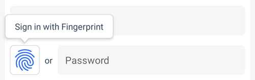
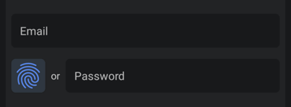

# OwnID React Native Core SDK - Custom Integration
The OwnID React Native Core SDK describes the way to integrate and use OwnID with custom identity platform.

The [OwnID](https://ownid.com/) React Native SDK is a client library that provides a passwordless login alternative for your React Native application by using cryptographic keys to replace the traditional password. The SDK allows the user to perform Registration and Login flows in a React Native application. The SDK is available from the npm repository. For more general information about OwnID SDKs, see [OwnID React Native SDK](../README.md).

## Table of contents
* [Add Dependency to your project](#add-dependency-to-your-project)
* [Configure Android](#configure-android)
* [Configure iOS](#configure=ios)
* [Integrate OwnID with your React Native App](#integrate-ownid-with-your-react-native-app)
   + [Registration](#registration)
   + [Login](#login)
* [Tooltip](#tooltip)   
* [Customizing the UI](#customizing-the-ui)

---

## Add Dependency to your project
The OwnID React Native Core SDK is available from the [npm repository](https://www.npmjs.com/package/@ownid/react-native-core):
```bash
npm install @ownid/react-native-core
cd ios && pod install && cd .. # CocoaPods on iOS needs this extra step
```
The OwnID React Native Core Android SDK supports [autolinking](https://github.com/react-native-community/cli/blob/main/docs/autolinking.md) and is built with Android API version 33 (minimum API version 23) and Java 8.

 The OwnID React Native Core iOS SDK supports iOS 13 and higher.

## Configure Android

**Create Configuration File**

The OwnID Core SDK uses a configuration file in your `assets` folder to configure itself. At a minimum, this JSON configuration file defines the OwnID App Id - the unique identifier of your OwnID application, which you can obtain from the [OwnID Console](https://console.ownid.com). Create `assets/ownIdCustomSdkConfig.json` and define the `app_id` parameter:

```json
{
   "app_id": "47tb9nt6iaur0zv"
}
```
Alternatively you can set configuration as a JSON string. More details in [OwnID Core Android SDK documentation](https://github.com/OwnID/ownid-android-sdk)

**Create OwnID Custom Integration**

To create custom interaction you have to create Kotlin or Java class (for example `OwnIdCustom`), make it extend `OwnIdCoreImpl` class and implement `register` and `login` methods. You can use this template:

See [complete example](../demo-custom/android/app/src/main/java/com/ownid/reactnative/demo/custom/OwnIdCustom.kt)

```kotlin
class OwnIdCustom(
    instanceName: InstanceName,
    configuration: Configuration,
    private val customAuthSystem: CustomAuthSystem // Instance of your identity platform
) : OwnIdCoreImpl(instanceName, configuration) {

    // Custom registration parameters in addition to user email (optional)
    class CustomRegistrationParameters(val name: String) : RegistrationParameters

    override fun register(email: String, params: RegistrationParameters?, ownIdResponse: OwnIdResponse, callback: OwnIdCallback<Unit>) {
        // Get custom registration parameters (optional)
        val name = (params as? CustomRegistrationParameters)?.name ?: ""

        // Generate random password
        val password = generatePassword(16)

        // Get OwnID Data
        val ownIdData = ownIdResponse.payload.ownIdData

        // TODO Add code that registers user in your system and set OwnID Data to user profile.
        // On registration success call: callback(Result.success(Unit))
        // on registration failure call: callback(Result.failure(cause /* registration error */))
    }

    override fun login(ownIdResponse: OwnIdResponse, callback: OwnIdCallback<Unit>) {
        // Get OwnID Data
        val ownIdData = ownIdResponse.payload.ownIdData

        // TODO Add code that log in user in your system using OwnID Data
        // On login success call: callback(Result.success(Unit))
        // on login failure call: callback(Result.failure(cause /* login error */))
    }

    companion object {
         @JvmStatic
         val INSTANCE_NAME: InstanceName = InstanceName("OwnIdCustom")

         const val CONFIGURATION_FILE: String = "ownIdCustomSdkConfig.json"

         const val PRODUCT_NAME_VERSION: String = "OwnIDCustom/2.1.0"
     }
}
```

**Create OwnID Custom FragmentManager and ReactPackage**

To create custom FragmentManager you have to create Kotlin or Java class (for example `OwnIdCustomFragmentManager`), make it extend `BaseOwnIdFragmentManager` class and implement `register` method. You can use this template:

See [complete example](../demo-custom/android/app/src/main/java/com/ownid/reactnative/demo/custom/OwnIdCustomFragmentManager.kt)

```kotlin
@androidx.annotation.OptIn(InternalOwnIdAPI::class)
public class OwnIdCustomFragmentManager(reactContext: ReactApplicationContext) : BaseOwnIdFragmentManager(reactContext) {

    override var instanceName: InstanceName = OwnIdCustom.INSTANCE_NAME

    protected override fun register(ownIdFragment: OwnIdFragment, args: ReadableArray?) {
        val loginId = args?.getString(0) ?: ""
        val name = args?.getMap(1)?.getString("name") ?: "" // Get additional registration data and pass them to register method
        val params = OwnIdCustom.CustomRegistrationParameters(name)
        ownIdFragment.register(loginId, params)
    }
}
```

To make `OwnIdCustomFragmentManager` available to React Native create `OwnIdCustomPackage`. You can use this template:

See [complete example](../demo-custom/android/app/src/main/java/com/ownid/reactnative/demo/custom/OwnIdCustomPackage.kt)

```kotlin
@androidx.annotation.OptIn(InternalOwnIdAPI::class)
public class OwnIdCustomPackage : ReactPackage {

    override fun createNativeModules(reactContext: ReactApplicationContext): MutableList<NativeModule> =
        mutableListOf()

    override fun createViewManagers(reactContext: ReactApplicationContext): List<ViewManager<out View, out ReactShadowNode<*>>> =
        mutableListOf(OwnIdCustomFragmentManager(reactContext))
}
```

**Create OwnID Custom Instance**

Before adding OwnID UI to your app screens, you need to use an Android Context and instance of your custom auth system to create an instance of OwnID Custom.

See [complete example](../demo-custom/android/app/src/main/java/com/ownid/reactnative/demo/custom/MainApplication.kt)

```kotlin
class MyApplication : Application() {
  override fun onCreate() {
    super.onCreate()
    
    // Create OwnID configuration
    val configuration = Configuration.createFromAssetFile(context, OwnIdCustom.CONFIGURATION_FILE, OwnIdCustom.PRODUCT_NAME_VERSION)

    // Create instance of OwnIDCustom
    val ownIdCustom = OwnIdCustom(OwnIdCustom.INSTANCE_NAME, configuration, customAuthSystem)

    // Put instance of OwnIdCustom to OwnID registry
    OwnId.putInstance(ownIdCustom)

    // Create Locale service for OwnIdCustom
    LocaleService.createInstance(context, ownIdCustom)
  }
}
```

The OwnID SDK reads the `ownIdCustomSdkConfig.json` configuration file from your `assets` folder and creates an instance that is accessible as `OwnId.getInstanceOrThrow(OwnIdCustom.INSTANCE_NAME)`.

Finally, locate ReactNativeHost’s getPackages() method and add the `OwnIdCustomPackage` package to the packages list getPackages():

See [complete example](../demo-custom/android/app/src/main/java/com/ownid/reactnative/demo/custom/MainApplication.kt#L22)

```kotlin
override fun getPackages(): List<ReactPackage> =
    PackageList(this).packages.apply {
        add(OwnIdCustomPackage())
    }
```

## Configure iOS

**Add Property List File to Project**

When the application starts, the OwnID SDK automatically reads `OwnIDConfiguration.plist` from the file system to configure the default instance that is created. In this PLIST file, you must define a redirection URI and the OwnID App Id. Create `OwnIDConfiguration.plist` and define the following mandatory parameters:

[Complete example](../demo-custom/ios/OwnIDReactNativeCustomDemo/OwnIDConfiguration.plist)
```xml
<?xml version="1.0" encoding="UTF-8"?>
<!DOCTYPE plist PUBLIC "-//Apple//DTD PLIST 1.0//EN" "http://www.apple.com/DTDs/PropertyList-1.0.dtd">
<plist version="1.0">
<dict>
	<key>OwnIDAppID</key>
	<string>47tb9nt6iaur0zv</string>
	<key>OwnIDRedirectionURL</key>
	<string>com.myapp.demo://ownid</string>
</dict>
</plist>
```

Where:

- The `OwnIDAppID` is the unique AppID, which you can obtain from the [OwnID Console](https://console.ownid.com).
- The `OwnIDRedirectionURL` is the full redirection URL, including its custom scheme. This URL custom scheme must match the one that you defined in your target.

**Create URL Type (Custom URL Scheme)**

You need to open your project and create a new URL type that corresponds to the redirection URL specified in `OwnIDConfiguration.plist`. In Xcode, go to **Info > URL Types**, and then use the **URL Schemes** field to specify the redirection URL. For example, if the value of the `OwnIDRedirectionURL` key is `com.myapp.demo://myhost`, then you could copy `com.myapp.demo` and paste it into the **URL Schemes** field.

**Initialize the SDK**

Now that you have added the OwnID package dependency, you need to import the OwnID module so you can access the SDK features. Add the following import to your source files:

```swift
import OwnIDCoreSDK
```

The OwnID React SDK must be initialized properly using the `configure(userFacingSDK:underlyingSDKs)` function, preferably in the main entry point of your app (in the `@main` `App` struct or `AppDelegate`).

[Complete example](../demo-custom/ios/OwnIDReactNativeCustomDemo/Sources/SDKInitializer.swift)
```swift
import OwnIDCoreSDK
@_exported import SDKCore

@objc
public final class OwnIDSDKInitializer: NSObject {
  static let sdkName = "OwnIDCustom"
  static let version = "2.1.0"
  
  @objc public static func initSDK() {
    //Init SDK
    OwnID.CoreSDK.shared.configure(userFacingSDK: info(), underlyingSDKs: [])

    //Setup controllerCreationClosure
    CreationInformation.shared.setupController()
  }
  
  public static func info() -> OwnID.CoreSDK.SDKInformation {
    (sdkName, version)
  }
}
```

Also, when react creates the OwnID button, you need to setup a child class of `OwnIDButtonViewController` and assign it as a `controllerCreationClosure` to communicate with Core SDK. For additional information see [Setup Custom Button View Controller](#setup-custom-button-view-controller)

[Complete example](../demo-custom/ios/OwnIDReactNativeCustomDemo/Sources/CreationInformation.swift)
```swift
import SDKCore

extension CreationInformation {
  func setupController() {
    controllerCreationClosure = { OwnIDCustomButtonViewController() }
  }
}
```

#### **Setup Custom Button View Controller**

OwnIDButtonViewController, which is part of the core SDK logic, has 5 methods that need to be overridden. You need to do 4 steps to complete the integration: 1) Create the child class, and implement these methods, 2) assign it as a `controllerCreationClosure` (as mentioned above), 3) Connect your logic to the `OwnIDCustomButtonViewController`. You can use the complete example or add the file `OwnIDCustomButtonViewController.swift` to your project and update the code with your custom implementation.

[Complete example](../demo-custom/ios/OwnIDReactNativeCustomDemo/Sources/OwnIDCustomButtonViewController.swift)
```swift
final class OwnIDCustomButtonViewController: OwnIDButtonViewController {
  private let sdkName = "OwnIDCustom"
  
  override func createRegisterViewModel() -> OwnID.FlowsSDK.RegisterView.ViewModel {
    OwnID.FlowsSDK.RegisterView.ViewModel(registrationPerformer: CustomRegistration(),
                                          loginPerformer: CustomLogin(),
                                          sdkConfigurationName: sdkName,
                                          webLanguages: .init(rawValue: Locale.preferredLanguages))
  }
  
  override func createLoginViewModel() -> OwnID.FlowsSDK.LoginView.ViewModel {
    OwnID.FlowsSDK.LoginView.ViewModel(loginPerformer: CustomLogin(),
                                       sdkConfigurationName: sdkName,
                                       webLanguages: .init(rawValue: Locale.preferredLanguages))
  }
  
  override func createOwnIDRegisterButton(for viewModel: OwnID.FlowsSDK.RegisterView.ViewModel) -> UIHostingController<OwnID.FlowsSDK.RegisterView> {
    let headerView = OwnID.FlowsSDK.RegisterView(viewModel: viewModel,
                                                 usersEmail: .init(get: { self.loginId }, set: { _ in }),
                                                 visualConfig: .init())
    let headerVC = UIHostingController(rootView: headerView)
    headerVC.view.backgroundColor = .clear
    return headerVC
  }
  
  override func createOwnIDLoginButton(for viewModel: OwnID.FlowsSDK.LoginView.ViewModel) -> UIHostingController<OwnID.FlowsSDK.LoginView> {
    let headerView = OwnID.FlowsSDK.LoginView(viewModel: viewModel,
                                              usersEmail: .init(get: { self.loginId }, set: { _ in }),
                                              visualConfig: .init())
    let headerVC = UIHostingController(rootView: headerView)
    headerVC.view.backgroundColor = .clear
    return headerVC
  }
  
  override func register(_ loginId: String, registrationParameters: [String: Any]) {
    do {
      let jsonData = try JSONSerialization.data(withJSONObject: registrationParameters)
      let params = try JSONDecoder().decode(CustomParameters.self, from: jsonData)
      ownIDRegisterModel?.register(with: loginId, registerParameters: params)
    } catch {
      print(error)
    }
  }
}
```

Next, assign it as a `controllerCreationClosure` (it's better to do it after the configuration of the SDK)

```swift
controllerCreationClosure = { OwnIDCustomButtonViewController() }
```

Next, update the methods `createRegisterViewModel` `createLoginViewModel`, by adding your own classes for registrationPerformer and loginPerformer parameters, that should be part of RegistrationPerformer and LoginPerformer protocols respectively

[Complete example](../demo-custom/ios/OwnIDReactNativeCustomDemo/Sources/OwnIDCustomButtonViewController.swift)
```swift
override func createRegisterViewModel() -> OwnID.FlowsSDK.RegisterView.ViewModel {
    OwnID.FlowsSDK.RegisterView.ViewModel(registrationPerformer: CustomRegistration(),
                                          loginPerformer: CustomLogin(),
                                          sdkConfigurationName: sdkName,
                                          webLanguages: .init(rawValue: Locale.preferredLanguages))
  }
  
  override func createLoginViewModel() -> OwnID.FlowsSDK.LoginView.ViewModel {
    OwnID.FlowsSDK.LoginView.ViewModel(loginPerformer: CustomLogin(),
                                       sdkConfigurationName: sdkName,
                                       webLanguages: .init(rawValue: Locale.preferredLanguages))
  }

  ....

final class CustomRegistration: RegistrationPerformer {
    func register(configuration: OwnID.FlowsSDK.RegistrationParameters, parameters: RegisterParameters) -> AnyPublisher<OperationResult, OwnID.CoreSDK.Error> {
        let ownIdData = configuration.payload.dataContainer
        return //Your register logic goes here
    }
}

final class CustomLogin: LoginPerformer {
  func login(payload: OwnID.CoreSDK.Payload, email: String) -> AnyPublisher<OwnID.LoginResult, OwnID.CoreSDK.Error> {
    return //Your login logic goes here
  }
}
```

There's one additional step to update `register` method with your own parameters 

```swift
struct CustomParameters: RegisterParameters, Decodable {
  let name: String
}

override func register(_ loginId: String, registrationParameters: [String: Any]) {
    do {
      // Get any additional registration data and pass it to register method
      let jsonData = try JSONSerialization.data(withJSONObject: registrationParameters)
      let params = try JSONDecoder().decode(CustomParameters.self, from: jsonData)
      ownIDRegisterModel?.register(with: loginId, registerParameters: params)
    } catch {
      print(error)
    }
  }
```

## Integrate OwnID with your React Native App

### Registration

Import OwnID Button and registration function and add an `OwnIdButton` view to your Registration screen:

```ts
import { OwnIdButton, OwnIdButtonType, OwnIdEvent, OwnIdRegister, OwnIdRegisterEvent } from '@ownid/react-native-core';
```

Add the passwordless authentication to your application's Registration screen by including the OwnIdButton view with type `register`. Call `OwnIdRegister` function once user finishes OwnID flow in OwnID WebApp and tap "Create Account" on registration form (check [complete example](../demo-custom/src/screens/Registration.js)):

```ts
const [name, setName] = useState('');
const [email, setEmail] = useState('');
const emailInputRef = useRef(undefined);

const [ownIdReadyToRegister, setOwnIdReadyToRegister] = useState(false);

const onSubmit = async (event) => {
  event.preventDefault();
  ...
  
  if (ownIdReadyToRegister) {
    OwnIdRegister(email, { name });
    return;
  }
  
  ...
}

const onOwnIdEvent = (event: OwnIdEvent) => {
  switch (event.eventType) {
      // Event when OwnID is busy processing request
      case OwnIdRegisterEvent.Busy:
        /* Show busy status 'event.isBusy' according to your application UI */
        break;

      // Event when user successfully finishes Skip Password in OwnID Web App  
      case OwnIdRegisterEvent.ReadyToRegister:
        /* Use 'event.authType' to get used authentication type */
        setOwnIdReadyToRegister(true);
        setEmail(event.loginId); // OwnID Web App may ask user to enter his login id (like email)
        break;
      
      // Event when user select "Undo" option in ready-to-register state
      case OwnIdRegisterEvent.Undo:
        setOwnIdReadyToRegister(false);
        break;

      // Event when OwnID creates user account and logs in user   
      case OwnIdRegisterEvent.LoggedIn:
        setOwnIdReadyToRegister(false);
        /* User is logged in with OwnID. Use 'event.authType' to get used authentication type */
        break;
      
      // Event when OwnID returns an error
      case OwnIdRegisterEvent.Error:
        /* Handle 'event.cause' according to your application flow  */
        break;
  }
};

return (
  <View>
    <TextInput value={name} onChangeText={setName} placeholder="First Name"/>
    <TextInput value={email} onChangeText={setEmail} ref={emailInputRef} placeholder="Email"/>

    <View>
      <OwnIdButton type={OwnIdButtonType.Register} loginIdRef={emailInputRef} onOwnIdEvent={onOwnIdEvent} />
      <TextInput placeholder="Password"/>
    </View>

    <TouchableOpacity onPress={onSubmit}><Text>Create Account</Text></TouchableOpacity>
  </View>
);
```

The OwnID `OwnIdRegister()` function must be called in response to the `ReadyToRegister` event. This function eventually calls native function `OwnIdCustom.register(loginId: String, params: RegistrationParameters?, ownIdResponse: OwnIdResponse, callback: OwnIdCallback<LoginData?>)` to register the user in your identity platform.

### Login

The process of implementing your Login screen is very similar to the one used to implement the Registration screen - add an `OwnIdButton` view to your Login screen. Your app then waits for events while the user interacts with OwnID.

Import OwnIdButton function:

```ts
import { OwnIdButton, OwnIdButtonType, OwnIdEvent, OwnIdLoginEvent } from '@ownid/react-native-core';
```

Similar to the Registration screen, add the passwordless authentication to your application's Login screen by including the OwnIdButton view with type `login`: (check [complete example](../demo-custom/src/screens/Login.js)):

```ts
const emailInputRef = useRef(undefined);

const onOwnIdEvent = (event: OwnIdEvent) => {
  switch (event.eventType) {
    // Event when OwnID is busy processing request
    case OwnIdLoginEvent.Busy:
      /* Show busy status 'event.isBusy' according to your application UI */
      break;
    
    //Event when user who previously set up OwnID logs in with Skip Password
    case OwnIdLoginEvent.LoggedIn:
      /* User is logged in with OwnID. Use 'event.authType' to get used authentication type */
      break;
    
    // Event when OwnID returns an error
    case OwnIdLoginEvent.Error:
      /* Handle 'event.cause' according to your application flow  */
      break;
    }
};

return (
  <View>
    <TextInput ref={emailInputRef} placeholder="Email"/>

    <View>
      <OwnIdButton type={OwnIdButtonType.Login} loginIdRef={emailInputRef} onOwnIdEvent={onOwnIdEvent} />
      <TextInput placeholder="Password"/>
    </View>
    ...
  </View>
);
```

## Tooltip
The OwnID SDK by default shows a Tooltip with text "Login with Fingerprint" on Android and "Login with FaceID / TouchID" on iOS. For Login the Tooltip appears/hides every time the OwnIdButton is shown/hides. For Registration the Tooltip appears when email input contains valid email address, and follows the same OwnIdButton shown/hides logic.

 

OwnIdButton has parameters to specify Tooltip parameters:
* `tooltipPosition` - tooltip position `top`/`bottom`/`start`/`end`/`none` (default `top`)
* `tooltipBackgroundColor` - tooltip background color (default value `#FFFFFF`, default value-night: `#2A3743`)
* `tooltipBorderColor` - tooltip border color (default value `#D0D0D0`, default value-night: `#2A3743`) 

Here's an example on how you can change these parameters:

```ts
<OwnIdButton ... onOwnIdEvent={onOwnIdEvent} style={{tooltipPosition: OwnIdTooltipPosition.Top, tooltipBackgroundColor: "#FFFFFF", tooltipBorderColor: "#D0D0D0"}}/>
```

## Customizing the UI

 

The following is a complete list of UI customization parameters:

**Parameters**

* `variant` - button icon variant (default value `OwnIdButtonVariant.Fingerprint`, alternative `OwnIdButtonVariant.FaceId`)
* `widgetPosition` - OwnID widget position relative to password input field (default value `OwnIdWidgetPosition.Start`, alternative `OwnIdWidgetPosition.End`)
* `showOr` - controls showing "or" (default value `true`)
* `backgroundColor` - background color of the button (default value `#FFFFFF`, default value-night: `#2A3743`)
* `borderColor` - border color of the button (default value `#D0D0D0`, default value-night: `#2A3743`) 
* `biometryIconColor` - icon or text color (default value `#0070F2`, default value-night: `#2E8FFF`)

Here's an example on how you can change these parameters:

```ts
<OwnIdButton ... variant={OwnIdButtonVariant.Fingerprint} widgetPosition={OwnIdWidgetPosition.Start} showOr={true} style={{ backgroundColor: "#FFFFFF", biometryIconColor: "#0070F2", borderColor: "#D0D0D0" }}/>
```
